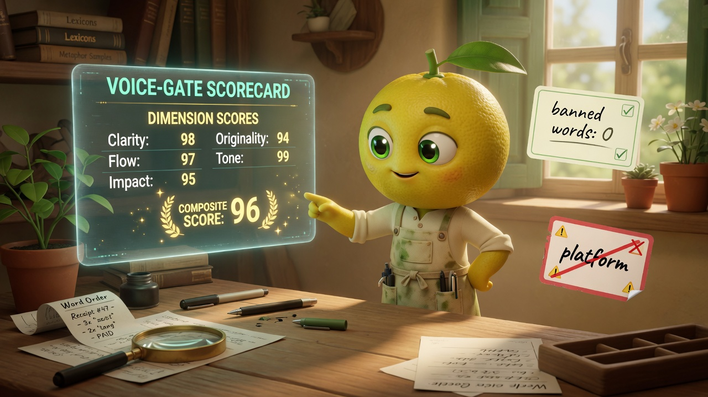
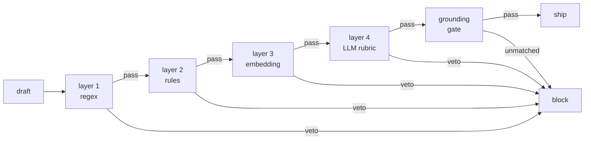

# zeststream-brand-voice

Catch AI-written copy that sounds right but says things you can't back up.



## Install

```bash
git clone https://github.com/JYeswak/zeststream-brand-voice.git
cd zeststream-brand-voice
pip install -e .
```

Safe to re-run. Requires Python 3.11+.

## Try it in 60 seconds

After install, paste this:

```bash
python -m zeststream_voice score "our platform synergizes client workflows" --brand zeststream
```

You will see:

```
status: FAIL
composite: 0.00

layers:
  layer1_banned_words: 0.00 (VETO) — 1 banned word(s) found
    - 'platform' @ [4, 12] …our platform synergizes…
```

Now try a claim check:

```bash
python -m zeststream_voice ground "I run 96 production workflows" --brand zeststream
```

```
matched: 1
  + 96 workflows -> n8n_workflow_count_2026_04_19
unmatched: 0
```

Swap `96` for `10000` and it fails — the number isn't in the receipt bank.

## What it does

- **Blocks slop words** with a regex pass — configurable per brand in `voice.yaml`
- **Blocks unsourced numbers** — every claim must match an entry in `capabilities-ground-truth.yaml`, or it stops there
- **Catches operator-name drift** — "Joshua" not "Josh"; rules are yours per brand
- **Runs in CI** — drop the included GitHub Action into any repo; PRs fail if copy slips

## What's live in v0.4

| Layer | Status | What it checks |
|---|---|---|
| 1 — regex + banned-words | **live** | banned word list, operator-name variants, trademark rendering |
| 2 — rules (three-moves) | roadmap (v0.5) | person named, receipt shown, invite-not-pitch |
| 3 — embedding similarity | roadmap (v0.6) | cosine similarity to your approved exemplars |
| 4 — LLM rubric (15-dim) | roadmap (v0.6) | voice, cadence, specificity, canon presence |
| Grounding gate | **live** | number-claim regex matches ground-truth YAML |

Layers 2-4 raise a clear `NotImplementedError` that points at the roadmap. Layer 1 and the grounding gate catch the bulk of shipped-today slop.

## What you'll need

- Python 3.11+
- A brand to check (use the `zeststream` brand as-is, or run the bootstrap script for your own)
- Optional: [Claude Code](https://docs.claude.com/en/docs/claude-code) if you want to use the companion skill for AI-assisted drafting inside this harness

## Configure for your brand

Create a fresh brand skeleton from the template:

```bash
./scripts/bootstrap-client.sh my-saas https://my-saas.example
```

That copies the template to `skills/brand-voice/brands/my-saas/` and seeds the slug. Then:

1. Edit `skills/brand-voice/brands/my-saas/voice.yaml` — canon line, banned words, pronoun rules
2. Edit `skills/brand-voice/data/capabilities-ground-truth.yaml` — every number and claim you can prove
3. Run: `python -m zeststream_voice score "test copy" --brand my-saas`

The 4-step walk-through lives in [`journey/`](journey/) — plan on 30-45 minutes for your first real brand.

## Run it in CI

A working GitHub Action ships at `.github/workflows/voice-check.yml`. It runs on every PR that touches markdown or brand config, fails the build if any file scores below 95. Copy it into your own repo, point it at your brand slug, done.

## How it works



Any single layer can veto. The composite is the weighted sum, but a veto overrides. One model grading its own output is the failure pattern — four independent checks with independent failure modes close that gap.

<details>
<summary>Weights, thresholds, and why four layers</summary>

Default weights: layer 1 = 0.15, layer 2 = 0.20, layer 3 = 0.25, layer 4 = 0.40. Composite must be >= 95 AND minimum layer score >= 9 AND grounding clean.

The full algorithm with veto rules and dimension breakdowns lives at [`skills/brand-voice/references/ALGORITHM.md`](skills/brand-voice/references/ALGORITHM.md).

Shorter answer on why four layers: a single rubric grading output from the same model class will mark its own cousin on-brand. The pattern is standard defense-in-depth, borrowed from security engineering.

</details>

## Hand-off to a client

When you're done, bundle the kit:

```bash
./scripts/client-handoff.sh my-saas
```

You get `handoffs/my-saas-brand-kit-<timestamp>.tar.gz` with the voice config, ground-truth, exemplars, visual identity, and journey docs. Ship that.

## Why this exists

In April 2026 I ran a per-page voice rubric against my own marketing site. Every route came back A-minus on tone. The pages also shipped claims like "95% deployment rate" — a number with no source, because there was no client roster that had generated it. The voice check was grading *how* things sounded. It wasn't checking *whether they were true.*

Two decades of running operations across insurance, title, and ISP businesses taught me that claims drift from reality fast when nothing structural catches them. A voice-only check grading its own output is the same failure shape: the writer and the checker share blind spots.

The fix is two structural changes, not more reminders to the writer:

1. Separate the claim check from the voice check. Every number gets extracted and matched against a canonical source, or the draft blocks.
2. Run four independent layers, each with veto. A single rubric marking its own cousin's output is the wrong shape.

The Peel → Press → Pour delivery flow around this loosely adapts Donella Meadows' systems thinking — [deeper dive in docs/methodology.md](docs/methodology.md).

## Who built this

Joshua Nowak. Solo operator, Montana. I wire AI into businesses that already work — insurance, title, ISP clients, and my own marketing pipelines. This repo is v0.4. The CLI, grounding gate, and bootstrap scripts work today; the embedding and rubric layers land in v0.5 and v0.6. Roadmap in issues.

Reach me at [zeststream.ai/consult](https://zeststream.ai/consult) or open an issue on this repo.

## License

MIT. Fork it, modify it, sell services around it.
