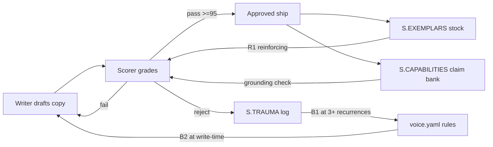

# Methodology — why this tool has the shape it has

## Who Donella Meadows was (60 seconds)

Donella Meadows (1941–2001) was an environmental scientist and systems thinker, lead author of *The Limits to Growth* (1972) and the posthumously published *Thinking in Systems* (2008). Her best-known contribution is the "12 leverage points" framework — a ranking of places to intervene in a complex system, from weakest (tweaking numbers) to strongest (changing the paradigm). This tool borrows her vocabulary for stocks, flows, and loops, and a handful of her leverage points. It does not borrow her policy conclusions, which are a different subject.

## The failure pattern this tool blocks

Most brand-voice systems are single-LLM checks: one model writes the copy, the same class of model grades it. The writer and the checker share the same training distribution, the same generic-SaaS priors, the same taste for tidy-sounding sentences that were never actually verified. The result is copy that scores 95 on tone and still contains a hallucinated statistic. On-brand, but unsourced.

The second failure pattern is a static PDF brand guide. Writers read it once, never again, and drift within thirty days back toward whatever phrasing the LLM produces by default. Guidance that lives only in a document the writer doesn't re-read is, in practice, absent.

## Stocks, flows, loops — in operator language

**Stock:** something that accumulates and persists. The claim bank grows when a verified fact is added and shrinks only when one is retracted.

**Flow:** something that changes a stock. A draft going to review is a flow into the exemplar stock (if it passes) or the trauma stock (if it fails).

**Loop:** a self-reinforcing or self-balancing circuit. Reinforcing loops compound; balancing loops push back toward a target.

| Element | Type | File in this repo |
|---|---|---|
| Approved claim bank | stock | `data/capabilities-ground-truth.yaml` |
| Approved copy corpus | stock | `brands/<slug>/exemplars/` |
| Rejection/trauma log | stock | `brands/<slug>/trauma.jsonl` |
| Draft → score → verdict | flow | `skills/brand-voice/references/ALGORITHM.md` |
| Approved ship → exemplar promotion | flow | scorecard log + promotion rule |
| Exemplars raise future scores | reinforcing loop (R1) | scoring pipeline |
| Trauma ≥3 recurrences → new rule | balancing loop (B1) | `voice.yaml` rule promotion |
| Scorer veto blocks bad draft at write-time | balancing loop (B2) | gate in ALGORITHM.md |

## Mermaid diagram — the feedback loops in this tool

R1 compounds: each approved ship becomes training material for the next draft, so scores trend up over time. B1 balances by turning repeated failures into permanent rules. B2 balances at the point of writing — the writer sees the veto before the draft ever reaches a reviewer.

## The 12 leverage points — where we actually intervene

Meadows ranked 12 places to change a system, weakest to strongest. We use a handful, not all of them. Being honest about which ones matters: most brand-voice projects claim "systems thinking" while only operating at #12 (tweak the style guide's bullet list).

| Leverage | Meadows lever | Where we apply it |
|---|---|---|
| #12 | constants and parameters | `voice.yaml` banned-words list |
| #6 | structure of information flow | grounding gate — the writer sees "no claim-bank match" before ship, not after |
| #4 | power to self-organize | trauma log at 3+ recurrences auto-proposes a new banned phrase |
| #3 | goals of the system | composite ≥95 AND min-dim ≥9 AND grounded — not just "sounds right" |
| #2 | paradigm behind the system | voice is a compounding asset, not a style guide |

#6 is the one most voice systems miss. Putting the signal at the point of writing, not at the point of review, changes who catches what. A writer staring at a "claim not in bank" warning rewrites the sentence in ten seconds. A reviewer catching it a week later has already lost the thread.

## What we changed / added

Meadows gave the vocabulary and the leverage ranking. The core contribution of this tool is the claim-grounding layer that most voice frameworks skip — a separate stock of approved factual claims, checked independently of tone. A voice-gate that grades only cadence, lexicon, and posture will happily approve a well-written lie. Adding grounding as a distinct dimension was a response to an actual production failure in 2026-04, where on-tone copy shipped hallucinated statistics.

The second addition is the multi-layer-veto architecture: regex rules, semantic embedding comparison, LLM rubric, and grounding check all run independently and any one can block. Single-model voice checks are self-referential — the grader and the generator share blind spots. Four independent layers catch different failure classes. None of these pieces is novel in isolation. The specific assembly — for this specific failure mode, in a solo-operator context — is what this tool contributes.

## Further reading

- Meadows, *Thinking in Systems* (2008) — the primary source
- Meadows, *Leverage Points: Places to Intervene in a System* (1999 essay, free online at donellameadows.org)

Back to [README](../README.md)
